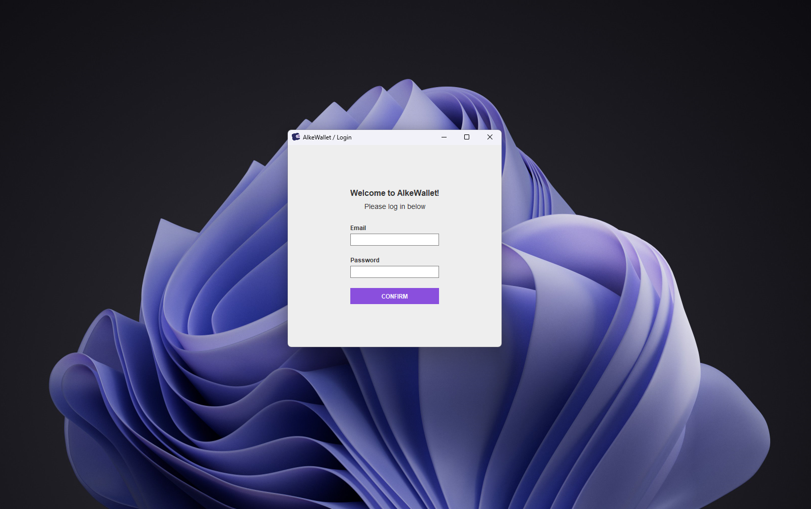
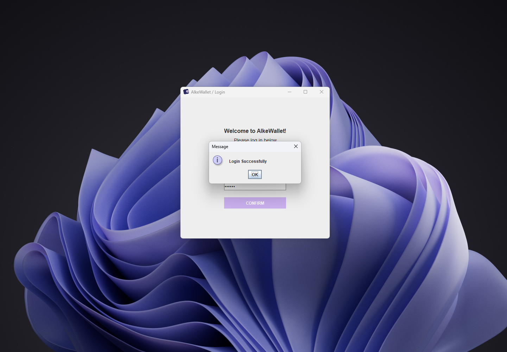
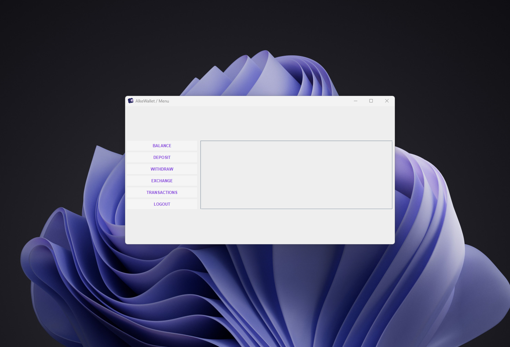
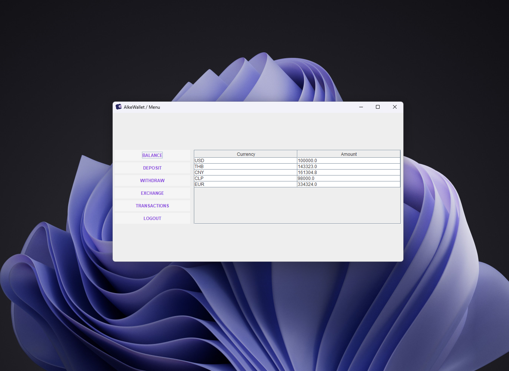
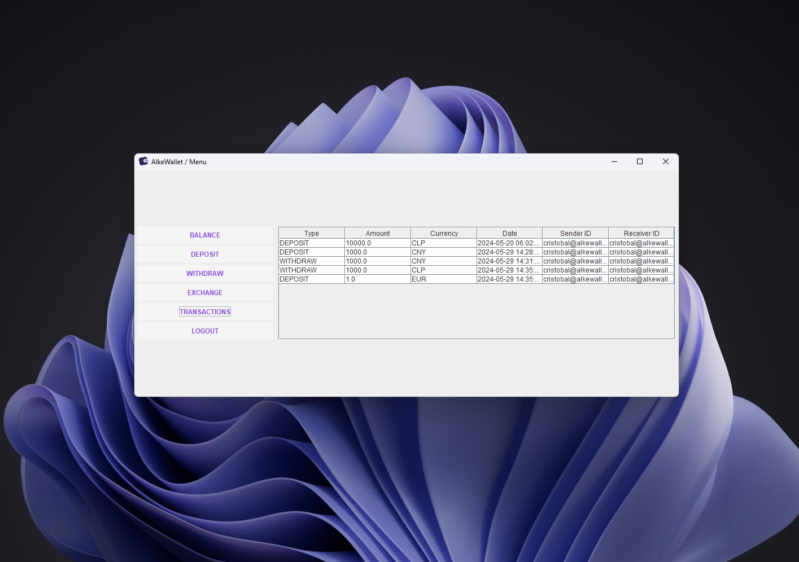
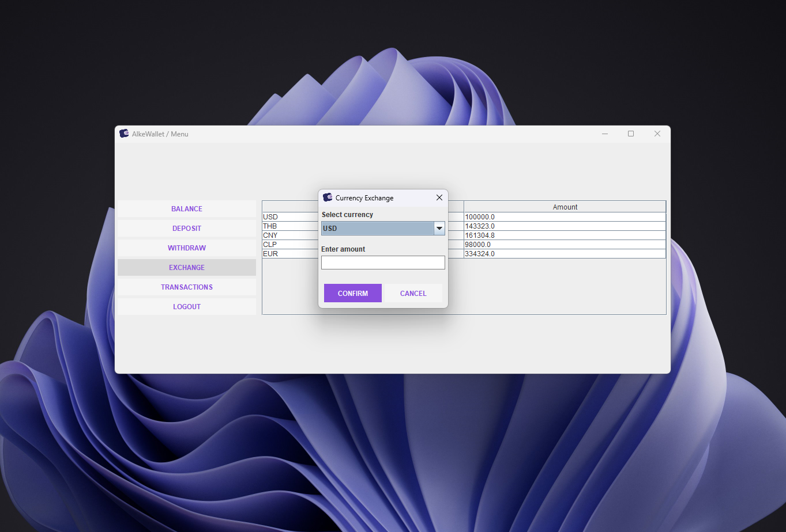

# AlkeWallet Windows GUI


## Overview

AlkeWallet is a wallet application that allows users to manage balances and transactions across different currencies. Key functionalities include user authentication, account management, and transactions such as deposits, withdrawals, and currency exchanges.

## Features

- User Authentication
- Create User Accounts
- Manage Balances for Different Currencies
- Deposit and Withdraw Funds
- Currency Exchange
- View User Accounts and Transactions

## Setup

1. **Clone the repository:**
    ```bash
    git clone https://github.com/zanozano/alkewalletm4_javaGUI.git
    cd alkewallet
    ```

2. **Set up the database:**
    - Create a database named `alkewallet`.
    - Run the SQL script located at `src/main/resources/db/schema.sql` to set up the tables.

3. **Configure the database connection:**
    - Update the database connection details in `src/main/resources/application.properties`.

4. **Build and run the project:**
    ```bash
    mvn clean install
    ```

### Screenshots






